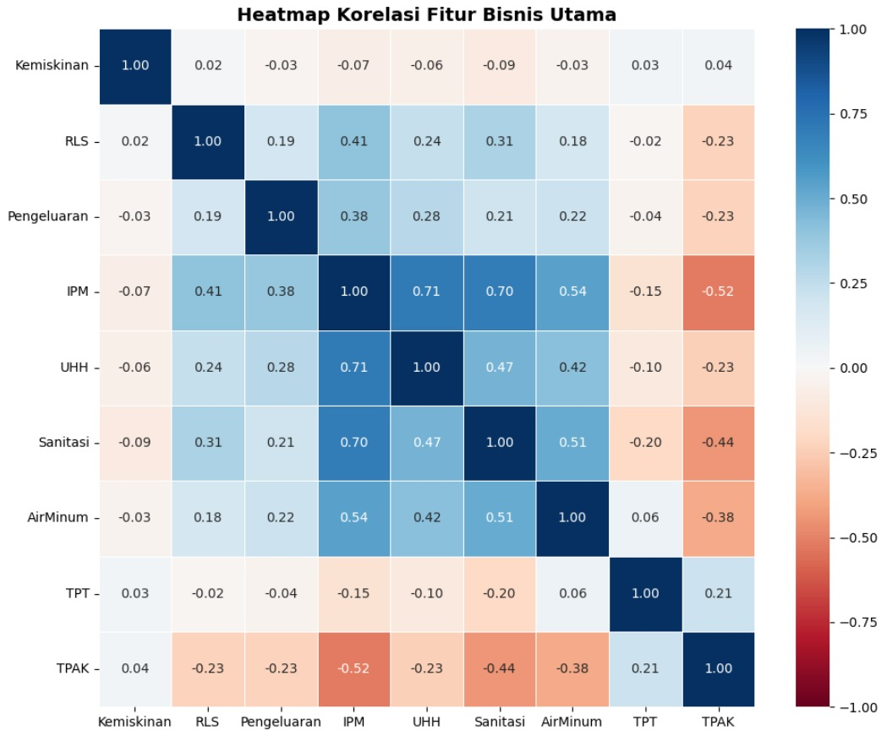
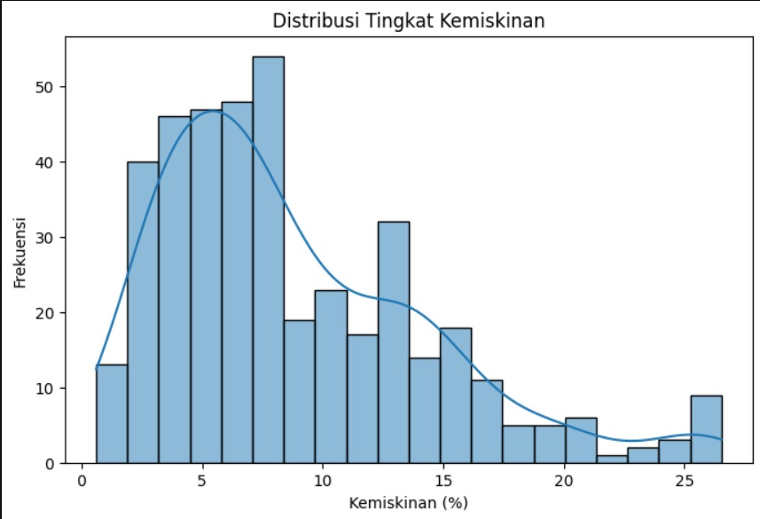
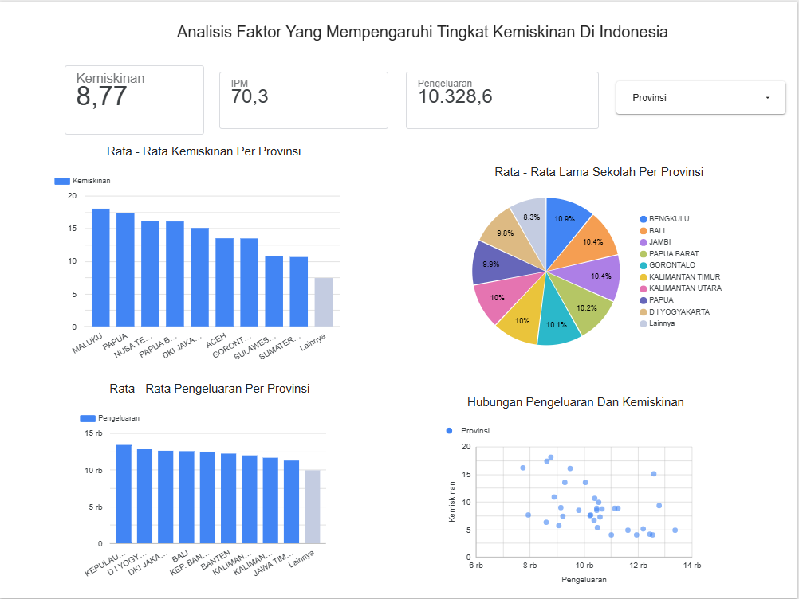

<div align="center">

# 🗺️ Indonesia Poverty Data Analysis Dashboard


*Analyzing socioeconomic indicators across Indonesian provinces to identify the key drivers of poverty and uncover regional patterns using exploratory data analysis and statistical correlation techniques.*

<br>

[](https://datastudio.google.com/reporting/294450e6-178f-41f8-8433-2fb2311d6d7b)

</div>

---

## 📌 Project Overview

This project explores **9 socioeconomic indicators** across Indonesian provinces to uncover what truly drives poverty — going beyond surface-level assumptions (like unemployment) to reveal stronger predictors such as **expenditure** and **Human Development Index (HDI)**.

**Key Questions Explored:**
- What is the distribution of poverty rates across Indonesian provinces?
- Which socioeconomic indicators have the strongest correlation with poverty?
- Does unemployment rate significantly influence poverty levels?
- Are there disparities in human development indicators across provinces?

---

## 🛠️ Tools Used

| Tool | Purpose |
|---|---|
| Python | Core programming language |
| Pandas | Data loading, cleaning, and manipulation |
| Matplotlib & Seaborn | Data visualization (heatmaps, boxplots, KDE plots) |
| IQR Method | Outlier detection and removal |
| Pearson Correlation | Statistical relationship analysis |
| Excel | Cleaned dataset export and documentation |

---

## 📁 Repository Structure

```
indonesia-poverty-analysis/
│
├── 📓 notebook/
│   └── poverty_analysis.ipynb        # Full EDA notebook
│
├── 📊 data/
│   ├── raw_data.csv                  # Original dataset
│   └── cleaned_data.xlsx             # Cleaned & exported dataset
│
├── 📈 results/
│   ├── correlation_heatmap.png       # Pearson correlation heatmap
│   ├── poverty_distribution.png      # Poverty rate histogram
│   ├── boxplot_outliers.png          # Boxplot for outlier detection
│   ├── kde_plots.png                 # KDE distribution plots
│   └── dashboard_preview.png         # Screenshot of Looker Studio dashboard
│
└── README.md
```

---

## 🔧 Data Preparation

1. **Loaded** provincial poverty dataset containing 9 socioeconomic indicators:
   - Poverty Rate, HDI, Expenditure, Life Expectancy, Sanitation, Clean Water Access, Unemployment Rate (TPT), Labor Force Participation (TPAK)

2. **Handled missing values** — dropped null rows to ensure analytical integrity

3. **Outlier removal** — applied IQR method on key columns (`Kemiskinan`, `TPT`, `Pengeluaran`) to reduce skewness

4. **Duplicate check** — validated and removed any duplicate records

5. **Exported** cleaned dataset to Excel for documentation and future use

---

## 🔍 Analysis Performed

- **Descriptive statistics** and distribution analysis on poverty rates across provinces
- **Pearson correlation matrix** across 9 socioeconomic variables to identify inter-variable relationships
- **Visualizations:** Heatmaps, Histograms, Boxplots, and KDE Plots

---

## 📸 Visualizations

### Correlation Heatmap


### Poverty Rate Distribution


### Dashboard Preview


---

## 💡 Key Insights

> **Expenditure & HDI are stronger poverty predictors than unemployment rate (r = 0.03)**

| Finding | Detail |
|---|---|
| 💰 Expenditure | Strong negative correlation with poverty — higher spending = lower poverty |
| 📚 HDI | Strong predictor of poverty and life outcomes across provinces |
| 🏥 HDI ↔ Life Expectancy | Strong positive correlation (r = **0.71**) — better HDI leads to better health |
| 👷 HDI ↔ TPAK | Negative relationship (r = **-0.52**) — higher HDI provinces have more selective workforce participation |
| 📉 Unemployment (TPT) | Very weak correlation with poverty (r = **0.03**) — not a reliable predictor |
| 🗺️ Regional Disparity | Poverty levels vary significantly across provinces, reflecting unequal development |

---

## ✅ Recommendations

- 💡 **Prioritize expenditure-based interventions** over unemployment-focused policies for poverty reduction
- 🎓 **Focus HDI improvement programs** in provinces with persistently high poverty rates
- 🗺️ **Use provincial-level correlation patterns** to design more targeted regional development strategies

---

## 📊 Live Dashboard

Explore the interactive provincial poverty dashboard visualizing poverty rate, expenditure, and schooling patterns:

<div align="center">

[](https://datastudio.google.com/reporting/294450e6-178f-41f8-8433-2fb2311d6d7b)

</div>

---

## 🚀 How to Run

```bash
git clone https://github.com/rafihanifafikri/indonesia-poverty-analysis.git
cd indonesia-poverty-analysis
pip install pandas matplotlib seaborn openpyxl
jupyter notebook notebook/poverty_analysis.ipynb
```

---

<div align="center">

## 👤 Author

**Rafi Hanifa Fikri**
📧 rafihanifafikri30@gmail.com
🎓 Information Systems — Gunadarma University

🏅 *This project is BNSP Certified upon completion*

---

*If you found this helpful, please consider giving a ⭐ to this repository!*

</div>
